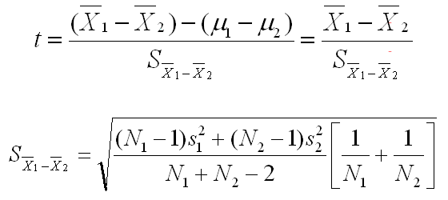
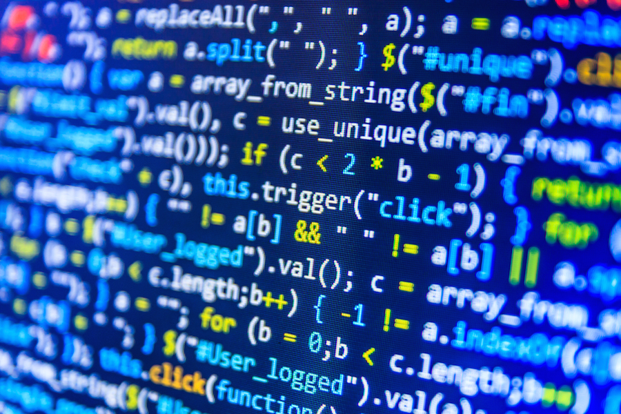

```{r setup, include=FALSE}
knitr::opts_chunk$set(echo = FALSE)
```

# Principle 1: Blur the lines between lecture and lab

## Anectode

While in lab section...

<center>
</center>


## Then and Now

* Segregated lecture/lab is a legacy of when:
    + Desktops reigned
    + Proprietary statistical software was often the best/only option
* Today
    + Almost all students have access to laptops
    + Open source software options are more palatable


## Images

<center></center>


## Images

<center></center>


# Principle 4: Use simulation/resampling for intro stats, not probability/large sample approximation

## Anectode

From my 300-level ~~Mathematical Statistics~~ Theory of Statistics:

<center></center>


## Insipiration

* Permutation tests are very intuitive
* Bootstrap takes a little more work
* Can avoid long march to Central Limit Theorem


# Principle 5: Don't fence off students from the computation pool, throw them in!

## How much programming?

* Forget Venn diagrams delineating Math vs CS vs Stats vs Data Science. 
If we blew up legacies and started over, what would we teach?
* Computational logic and algorithmic thinking are paramount to statistics/data science
* **Something bigger**: Very soon, coding will be a basic skill on par with reading and writing.


## Easier said than done...

* Repeat this mantra ad nauseum: "Computers are stupid!"
* R has come a long way: ecosystem online, packages, and DataCamp.
* Present students with this choice of what Cobb terms the "computational engine" of statistics:

This...           |  Or this...
:-------------------------:|:-------------------------:
  |    


