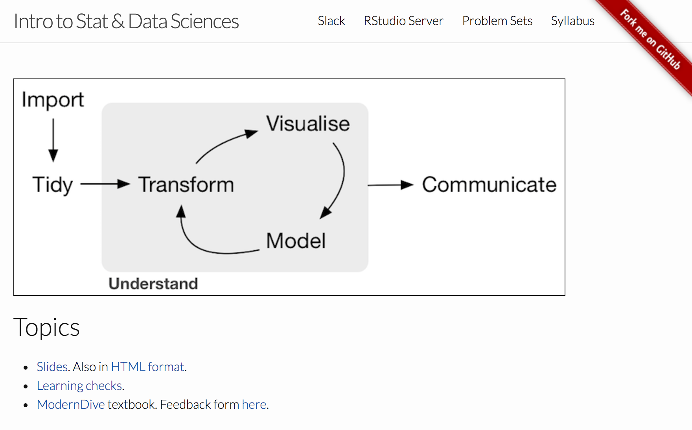

class: center, middle

```{r setup, include=FALSE}
# devtools::install_github("yihui/xaringan")
library(tidyverse)
library(knitr)
theme_set(theme_gray(base_size = 26))
options(htmltools.dir.version = FALSE, scipen = 99)
knitr::opts_chunk$set(echo = FALSE, fig.width=10.5, fig.height=4.5)
```

# Why is this needed?

<center>
<a href="http://vignette2.wikia.nocookie.net/legomessageboards/images/5/51/House-of-cards-but-why.gif/revision/latest?cb=20150203023508"> </a>
</center>

---

class: center, middle

## Guiding Principles of ModernDive

***

## 1. Blur the lines between lecture and lab

### While in lab section...

<center>
</center>

---

## Then and Now

* Segregated lecture/lab is a legacy of when:
    + Desktops reigned
    + Proprietary statistical software was <br> usually the best/only option
--
* Today
    + Almost all students have access to laptops
    + Open source software options are more palatable
---

## A new classroom environment

<center></center>

---

## Working like data scientists/statisticians work

<center></center>

---

## Guiding Principles of ModernDive

***

## 2. Focus on the data/science research pipeline

```{r out.width="100%"}
knitr::include_graphics("images/hadley.png")
```

---

## Creating effective data stories is the key

- Each topic builds on previous topics towards improving communication using data

<center>
<br>
<a href="https://fivethirtyeight.com/features/the-dollar-and-cents-case-against-hollywoods-exclusion-of-women/"> </a>
</center>

---
## Guiding Principles of ModernDive

***

## 3. It's all about the data

- Use modern R packages with rich, interesting, open data

```{r echo=FALSE, warning=FALSE}
library(nycflights13)
library(ggplot2)
ggplot(data = weather, mapping = aes(x = factor(month), y = temp)) +
  geom_boxplot(na.rm = TRUE) +
  labs(title = "Hourly Temperatures by Month in NYC in 2013", x = "Month", 
       y = expression("Temperature("*degree*F*")"))
```

---

## Have data visualization be the driver

```{r echo=FALSE, fig.height=7}
library(gapminder)
ggplot(gapminder %>% filter(year == 2002), 
       aes(gdpPercap, lifeExp, size = pop, color = continent)) +
  geom_point() +
  scale_x_log10() +
  labs(x = "GDP Per Capita", y = "Mean Life Expectancy", title = "By Region in 2002")
```


---

## Guiding Principles of ModernDive

***

## 4. Use simulation/resampling instead of probability


### <div style="float: left; width: 60%;">From Albert's 300-level ~~Mathematical Statistics~~ Theory of Statistics: </div>


<div style="float: right; width: 40%;">
<center></center>
</div>

---

## Reinforce concepts instead of equations, formulas, and probability tables

- Build the Central Limit Theorem using computation
- Check for assumptions needed for traditional inference using algorithmic thinking
--

```{r, fig.align="center", out.width="82%"}
knitr::include_graphics("images/tdist.png")
```

---

## Inspiration and common theme

### There is only ONE (hypothesis) test!

<br><br>

<center>
<a href="http://allendowney.blogspot.com/2016/06/there-is-still-only-one-test.html"> </a>
</center>

---


## 5. Don’t fence off students from the computation <br> &nbsp; &nbsp; pool, throw them in!

- <small>Scaffold & support as a good foreign language professor would</small>

<center>
<br>
<a href="http://giphy.com/gifs/pool-diving-synchronized-swimming-pDWtwK7D2IlFu"> </a>
</center>

---

# Developing a needed skill

- Coding will be a basic skill on par with reading and writing.

<center>
<br>
<a href="https://static1.squarespace.com/static/5150aec6e4b0e340ec52710a/t/51525c33e4b0b3e0d10f77ab/1364352052403/Data_Science_VD.png"> </a>
</center>

---

# Developing a needed skill

- Coding will be a basic skill on par with reading and writing.

<center>
<br>
<a href="https://static1.squarespace.com/static/5150aec6e4b0e340ec52710a/t/51525c33e4b0b3e0d10f77ab/1364352052403/Data_Science_VD.png"> </a>
</center>

---


## 6. Complete reproducibility with `bookdown`

### - Put it all out there

### - Ultimately the best textbook is one you’ve written yourself

<center>
<a href="http://giphy.com/gifs/oskouioskoui-lotr-gifscapade-3oFyCVxsQn6RBa0r5u"> </a>
</center>

---

## The `bookdown` R package

- Write an entire book using [R](https://rmarkdown.rstudio.com/) and [Markdown](https://daringfireball.net/projects/markdown/syntax)
- Rapid iteration and easily-updateable
- Exports book to multiple formats
- Slick cross-references
- Textbook has versions not editions
- Wikipedia model for intro stats/data science

<br>
- [A <small>`bookdown`</small> book about writing with <small>`bookdown`</small>](https://bookdown.org/yihui/bookdown/)

---

class: center, middle

# ModernDive

## An Introduction to Statistical and Data Sciences via R

***

### Authors:  Chester Ismay, Albert Y. Kim and you?

## [ModernDive.com](http://moderndive.com)

OR

## [ModernDive.org]((http://moderndive.com)

---

class: center, middle

# Supplementary materials to the textbook


---

## The [<small>`fivethirtyeight`</small>](https://cran.r-project.org/web/packages/fivethirtyeight/vignettes/fivethirtyeight.html)  R package

- Data sets that balance being
    - *rich enough* to answer meaningful questions with, 
    - *real enough* to ensure that there is context, and 
    - *realistic enough* to convey to students that data as it exists "in the wild" often needs processing.
--
- Easily and quickly accessible to novices, so that we [minimize the prerequisites to research](https://arxiv.org/abs/1507.05346).

---

## The [<small>`fivethirtyeight`</small>](https://CRAN.R-project.org/package=fivethirtyeight) R package  

```{r eval=FALSE, echo=FALSE}
library(fivethirtyeight)
data(police_locals)
```

<br>

<center>
<a href="https://fivethirtyeight.com/datalab/most-police-dont-live-in-the-cities-they-serve/"> </a>
</center>


---

## [DataCamp course](https://www.datacamp.com/courses/effective-data-storytelling-using-the-tidyverse)

<center>
<a href="https://www.datacamp.com/courses/effective-data-storytelling-using-the-tidyverse"> </a>
</center>

---

## Tips from us

- We think the model for teaching intro stats is evolving rapidly.
- We use the chalkboard/white board for writing code, for coloring plots, and for better engaging with our students.

---

## Start small

- Adding just a few of our ideas and materials into your course can go a long way

<center>
<br>
<a href="https://www.amazon.com/Small-Teaching-Everyday-Lessons-Learning/dp/1118944496"> </a>
</center>


---

## [Chester's Social Statistics course webpage](https://ismayc.github.io/soc301_s2017/)


<center>
<a href="https://ismayc.github.io/soc301_s2017/schedule/"> </a>
</center>

---

## [Albert's Intro to Stat & Data Sciences course webpage](https://rudeboybert.github.io/MATH116/)

<center>
<a href="https://rudeboybert.github.io/MATH116/"> </a>
</center>

---

## What's to come

- Add more interactive shiny apps into the book

- Create more Review Questions at chapter ends using <small>`fivethirtyeight`</small> and other open data sources

- Design and share instructor resources

- Finish DataCamp course to supplement and assist with more immediate feedback

---

layout: true

.footer[These slides available at <http://bit.ly/moderndive-causeweb> <br> Source code for slides at <https://github.com/ismayc/causeweb2017>]

---

## [ModernDive.com](http://www.moderndive.com)

- <small>Join us for a [workshop](https://www.causeweb.org/cause/uscots/uscots17/workshop/3) with many more details at USCOTS at <br> Penn State on May 17-18</small>
- <small>Slides created via the R package [xaringan](https://github.com/yihui/xaringan) by Yihui Xie.</small>
- <small>[Source code for ModernDive](https://github.com/ismayc/moderndiver-book)</small>
    - <small>Feel free to modify the book as you wish for your own needs! Just please list the authors as "Chester Ismay, Albert Y. Kim, and YOU!"</small>
- <small>Fill out form to receive updates using [MailChimp](http://eepurl.com/cBkItf)</small>
- <small>Email us at <chester@moderndive.com> or <albert@moderndive.com></small>
- <small>Follow us on Twitter:  @old_man_chester, @rudeboybert</small>
